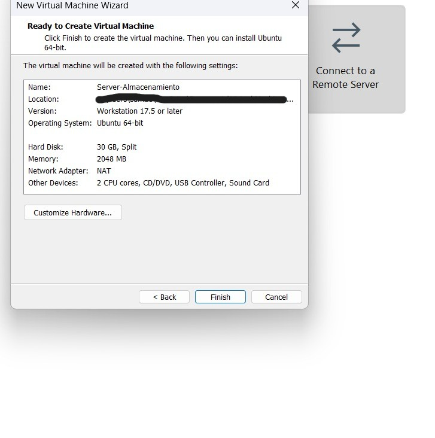
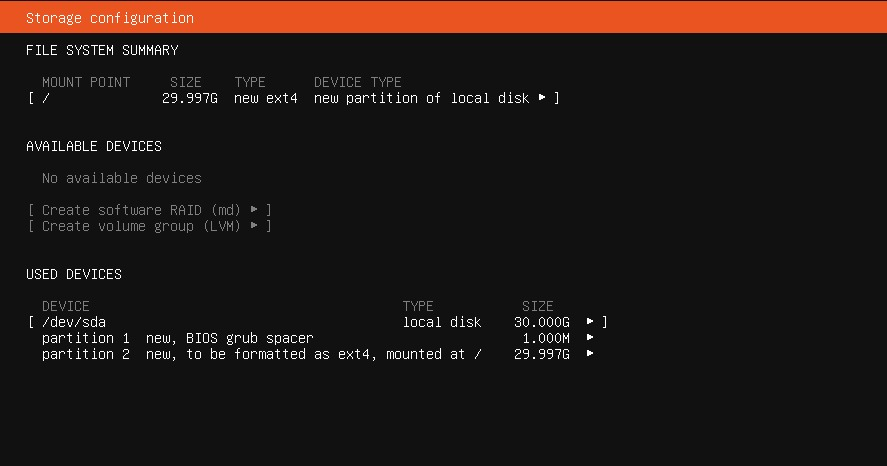
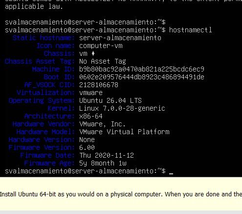
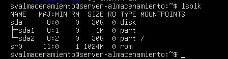

# Miniproyecto 0: preparación de Ubuntu Server en VMware

## Contexto del miniproyecto

Este miniproyecto forma parte de una ruta de aprendizaje cuyo objetivo final es construir un laboratorio de almacenamiento centralizado con tecnologías NAS, SAN e iSCSI.

Antes de trabajar con discos, particiones, volúmenes, permisos o almacenamiento por red, necesitaba preparar y comprender la máquina virtual que servirá como laboratorio. No quería limitarme a copiar una configuración terminada. El propósito fue entender qué estaba creando, qué función cumple cada componente virtual y por qué una decisión puede ser apropiada para este proyecto.

Al comenzar tenía poca experiencia con Linux. Lo había utilizado aproximadamente dos veces y recordaba principalmente el acceso mediante SSH. Tampoco tenía clara la secuencia necesaria para preparar un disco nuevo ni la diferencia entre conceptos como particionar, fragmentar, formatear y montar.

Este README documenta tanto el resultado técnico como mi proceso de razonamiento, los errores que cometí y lo que aprendí al corregirlos.

## Relación con el proyecto final

La máquina virtual creada será la base de los siguientes subproyectos:

1. Identificación de discos en Linux
2. Particionado y sistemas de archivos
3. Montaje de volúmenes
4. Usuarios, grupos y permisos
5. Compartición de archivos mediante NAS
6. Red dedicada al almacenamiento
7. Redundancia y RAID
8. Configuración de iSCSI Target e Initiator
9. Presentación y uso de LUN
10. Integración final de NAS y SAN

Separar esta preparación del proyecto final me permitió concentrarme en una sola pregunta: **¿cómo crear una VM segura, equilibrada y reutilizable antes de empezar a configurar almacenamiento?**

## Lo que sabía y lo que no sabía al comenzar

### Conocimientos previos

- Sabía que utilizaría máquinas virtuales
- Tenía VMware instalado
- Mi computadora tenía Windows 11, 16 GB de RAM y aproximadamente 200 GB disponibles
- Había usado SSH anteriormente
- Me interesaba Ubuntu Server porque consume menos recursos y se parece a un servidor empresarial

### Dudas iniciales

- No conocía la edición ni la versión exacta de VMware
- No sabía qué versión de Ubuntu debía instalar
- No sabía cómo comprobar que una ISO fuera íntegra
- No sabía cuánto procesador, RAM y disco asignar
- Confundía algunas operaciones de almacenamiento
- No comprendía la diferencia entre ISO y VMDK
- No sabía qué modo de red utilizar
- No sabía si LVM era necesario para poder añadir otro disco después
- No sabía cómo confirmar que Ubuntu había iniciado desde el disco correcto

## Aprendizaje previo sobre discos

Antes de crear la VM razoné sobre lo que ocurre con un disco nuevo.

Inicialmente pensé que el disco debía “dividirse”. Esa idea se relacionaba con **particionar**, que significa crear divisiones lógicas dentro de un disco. Sin embargo, todavía faltaba preparar esas divisiones para almacenar archivos.

Cuando intenté identificar ese paso, primero pensé en “conectar” y después en “fragmentar”. Aprendí que no significan lo mismo:

- **Conectar:** permite que el equipo detecte un dispositivo
- **Particionar:** divide lógicamente un disco
- **Fragmentar:** describe un archivo cuyas partes quedan dispersas, no una preparación intencional del disco
- **Formatear:** crea un sistema de archivos para organizar y localizar archivos
- **Montar:** hace accesible un sistema de archivos desde una ubicación de Linux

La secuencia conceptual que comprendí fue:

```text
Conectar → Particionar → Formatear → Montar
```

Esta base será necesaria cuando añadamos el segundo disco virtual de prácticas.

## Decisión del sistema operativo

Comparé Ubuntu Desktop con Ubuntu Server.

Elegí **Ubuntu Server** porque no necesita una interfaz gráfica, consume menos recursos y permite practicar en un entorno más parecido a un servidor empresarial. También comprendí que no se administra mediante CMD. Ubuntu utiliza una terminal de Linux, que visualmente se parece a CMD o PowerShell, pero usa herramientas diferentes.

Elegí una versión **LTS**, soporte a largo plazo, porque el laboratorio continuará creciendo durante varios subproyectos. Una versión estable y con mantenimiento prolongado es más apropiada que una versión con soporte breve.

## Verificación del entorno

Se identificó el hipervisor instalado:

| Elemento | Resultado |
|---|---|
| Programa | VMware Workstation Pro |
| Versión | 17.6.4 |
| Sistema anfitrión | Windows 11 |
| RAM física | 16 GB |
| Espacio disponible aproximado | 200 GB |

Un **hipervisor** es el programa que crea y administra máquinas virtuales. Es como el encargado que reparte a cada computadora simulada una parte del procesador, la memoria, el almacenamiento y la red del equipo real.

## Descarga segura de Ubuntu Server

La ISO se descargó desde la página oficial de Ubuntu:

```text
ubuntu-26.04-live-server-amd64.iso
```

Aprendí que:

- Una **ISO** funciona como un DVD virtual de instalación
- `amd64` identifica la arquitectura de 64 bits compatible con procesadores AMD e Intel
- El nombre y el tamaño del archivo no bastan para demostrar su integridad

### Comprobación SHA-256

Al principio pensé que podía verificarse comparando el tamaño de la ISO con la memoria RAM. Esa idea era incorrecta porque la ISO ocupa almacenamiento y la RAM mantiene temporalmente procesos en ejecución. Son medidas relacionadas con funciones diferentes.

Aprendí que debía comparar dos huellas:

1. La huella SHA-256 calculada en mi computadora
2. La huella SHA-256 publicada oficialmente por Ubuntu

La comprobación se realizó en PowerShell con:

```powershell
Get-FileHash ubuntu-26.04-live-server-amd64.iso
```

El resultado coincidió con el valor oficial. Las letras mayúsculas y minúsculas no cambiaban el valor hexadecimal.

También aprendí cuándo utilizar las terminales de Windows:

- CMD sirve para comandos tradicionales y tareas básicas
- PowerShell ofrece herramientas más modernas de administración
- Los nombres que comienzan con verbos como `Get-`, `Set-` o `New-` suelen pertenecer a PowerShell

## Creación razonada de la máquina virtual

Se eligió el modo **Custom** del asistente. La opción Typical habría automatizado varias decisiones, mientras que Custom permitió analizar los componentes y evitar una asignación exagerada.

También se eligió instalar el sistema operativo posteriormente. Al principio seleccioné la ISO directamente, pero VMware intentaba usar Easy Install. Después comprendí que crear primero la VM vacía y conectar manualmente la ISO permitía controlar el proceso y observar cada decisión del instalador.

## Configuración final y razones

| Componente | Configuración | Motivo de la decisión |
|---|---|---|
| Nombre de la VM | Server-Almacenamiento | Identifica la función futura del servidor |
| Compatibilidad | Workstation 17.5 o posterior | Compatible con VMware 17.6.4 |
| Sistema invitado | Linux, Ubuntu 64-bit | Coincide con la ISO descargada |
| Procesadores virtuales | 1 | No era necesario simular dos procesadores físicos |
| Núcleos | 2 | Capacidad suficiente sin quitar recursos innecesarios a Windows |
| RAM | 2 GB | Ubuntu Server no tiene interfaz gráfica y puede ampliarse después |
| Red | NAT | Permite Internet sin exponer directamente el servidor a la red física |
| Controlador | LSI Logic | VMware lo recomendó para el sistema invitado |
| Tipo de disco | SCSI | Coherente con LSI Logic y habitual en servidores |
| Capacidad máxima | 30 GB | Proporciona margen para Ubuntu, actualizaciones y registros |
| Reserva inmediata | Desactivada | El VMDK crece según se utiliza |
| Formato del VMDK | Varios archivos | Facilita mover o respaldar el laboratorio |
| Sistema de archivos | ext4 | Sistema de archivos estándar y estable para Linux |
| Red del instalador | DHCP sobre NAT | Proporciona una dirección automáticamente |
| Acceso remoto | OpenSSH Server | Permitirá administrar Ubuntu desde Windows |

### Procesadores y núcleos

Primero elegí 2 procesadores con 1 núcleo cada uno. Aprendí que, aunque el total seguía siendo 2 núcleos, esa configuración simulaba dos chips separados. Para un servidor pequeño era más simple utilizar 1 procesador con 2 núcleos.

La analogía utilizada fue pensar en un procesador como una oficina y en sus núcleos como trabajadores dentro de ella. No necesitaba construir dos oficinas para tener dos trabajadores.

### Memoria RAM

VMware propuso inicialmente 4 GB. Consideré que 2 GB eran suficientes porque Ubuntu Server no tendría entorno gráfico. Esta decisión dejó más memoria disponible para Windows y no es permanente, ya que VMware permite ampliarla cuando los servicios futuros lo requieran.

Comprendí que asignar más recursos no siempre mejora el resultado. El sistema anfitrión también necesita memoria y procesador para funcionar.

### Red NAT

Estuve entre Bridged y NAT:

- **Bridged:** la VM aparece como otro equipo independiente en la red física
- **NAT:** la VM utiliza la conexión de Windows para salir a Internet y queda detrás de VMware

Elegí NAT porque durante la instalación necesitaba Internet, pero todavía no necesitaba exponer el servidor directamente. La red podrá modificarse cuando estudiemos redes de almacenamiento.

### Disco virtual y disco físico

Se creó un disco virtual nuevo. Esto fue importante porque un VMDK es un archivo que VMware presenta a Ubuntu como si fuera un disco real. No se dio acceso directo a un disco físico.

Aprendí la diferencia:

- **ISO:** medio desde el que se instala Ubuntu
- **VMDK:** disco interno virtual donde Ubuntu queda instalado

Por esa razón el VMDK recibió un nombre relacionado con el sistema y no con la ISO.

### Capacidad dinámica

Al principio pensé en marcar **Allocate all disk space now**, pero eso habría reservado los 30 GB completos inmediatamente. Se dejó desmarcada para que el archivo creciera conforme Ubuntu almacenara información.

Los 30 GB son un límite máximo, no el espacio que se ocupa desde el primer momento.

### Ubicación fuera de OneDrive

La ubicación inicial estaba dentro de OneDrive. Se cambió a una carpeta local porque los archivos de una VM cambian constantemente. La sincronización podría ocasionar lentitud, conflictos o copias incompletas.

La ISO presenta menos riesgo porque normalmente se utiliza solo para lectura, pero también se copió a una ubicación local para evitar depender de su disponibilidad en la nube durante la instalación.

## Instalación razonada de Ubuntu

Durante el instalador se tomaron estas decisiones:

- Interfaz en inglés para aprender terminología técnica y facilitar la búsqueda de errores
- Teclado English US porque el teclado físico no tenía tecla Ñ y los símbolos coincidieron en la prueba
- Ubuntu Server estándar en vez de minimized
- Sin controladores de terceros porque VMware presenta hardware virtual compatible
- Mirror regional de Ecuador validado correctamente
- Sin proxy porque no se recibió una dirección de proxy institucional
- Sin Ubuntu Pro porque no era necesario vincular servicios adicionales
- Sin snaps opcionales porque quiero instalar cada servicio cuando corresponda y entender su función

## Decisión de almacenamiento durante la instalación

La pantalla de almacenamiento mostraba únicamente:

```text
/dev/sda local disk 30.000G
```

Al principio no sabía cómo confirmar que era el disco virtual. Aprendí a comparar su tamaño:

- Almacenamiento físico disponible aproximado: 200 GB
- VMDK creado: 30 GB
- Disco detectado por Ubuntu: 30 GB

La coincidencia confirmó que `/dev/sda` era el disco virtual nuevo.

### Por qué no se utilizó LVM todavía

Inicialmente pensé que debía mantener LVM porque de lo contrario tendría que crear otra máquina virtual para añadir otro disco. Esa idea era incorrecta.

Aprendí que VMware permite añadir un segundo VMDK a esta misma VM independientemente de que el disco del sistema use LVM. Por eso desmarqué LVM para mantener sencilla la instalación inicial.

LVM se estudiará después, cuando pueda compararlo con particiones directas y comprender sus ventajas.

La estructura instalada fue:

| Dispositivo | Función |
|---|---|
| `/dev/sda` | Disco virtual de 30 GB |
| `/dev/sda1` | Espacio pequeño para el arranque |
| `/dev/sda2` | Partición principal ext4 montada en `/` |

`/` es la raíz del sistema Linux, el punto principal del que dependen las demás carpetas.

## Usuario y seguridad

Se configuró:

```text
Hostname: server-almacenamiento
Usuario: svalmacenamiento
```

Durante el proceso compartí accidentalmente una contraseña corta. Aprendí dos reglas importantes:

1. Una contraseña nunca debe publicarse en documentación, capturas, repositorios o chats
2. Si una contraseña se comparte, debe considerarse expuesta y reemplazarse

La contraseña se cambió por una nueva y no se documentó.

OpenSSH Server quedó instalado para utilizar posteriormente acceso remoto desde Windows. Por ahora se habilitó autenticación por contraseña para facilitar el aprendizaje. Las claves SSH se estudiarán después como un método más seguro.

## Verificaciones finales

### Identidad de Ubuntu

Se utilizó:

```bash
hostnamectl
```

Se confirmó:

```text
Static hostname: server-almacenamiento
Operating System: Ubuntu 26.04 LTS
Virtualization: vmware
Architecture: x86-64
```

### Discos detectados

Se utilizó:

```bash
lsblk
```

Se interpretó el resultado:

| Dispositivo | Tamaño | Tipo | Interpretación |
|---|---:|---|---|
| `sda` | 30 GB | disk | Único disco virtual del sistema |
| `sda1` | 1 MB | part | Partición de arranque |
| `sda2` | 30 GB | part | Partición de Ubuntu montada en `/` |
| `sr0` | 1 GB | rom | Lector de CD/DVD virtual |

Esto confirmó que todavía no se había añadido el segundo disco de prácticas.

### Arranque sin la ISO

Después de instalar Ubuntu se desconectó la ISO y se desmarcó **Connect at power on**. La VM se encendió nuevamente y llegó directamente al login.

Esta prueba demostró que Ubuntu arrancaba desde el VMDK y ya no dependía del instalador.

### Apagado seguro

La VM se apagó desde Ubuntu con:

```bash
sudo poweroff
```

Aprendí que cerrar una VM bruscamente se parece a desconectar una computadora de la corriente. Un apagado ordenado permite cerrar procesos y guardar datos correctamente.

## Resultado del miniproyecto

La VM quedó configurada con:

- VMware Workstation Pro 17.6.4
- Ubuntu Server 26.04 LTS
- 1 procesador virtual
- 2 núcleos
- 2 GB de RAM
- 1 disco SCSI de sistema de 30 GB
- Red NAT
- OpenSSH Server instalado
- ISO desconectada del arranque
- Inicio de sesión comprobado
- Segundo disco de prácticas todavía no añadido

## Lo más importante que aprendí

No aprendí solamente a pulsar opciones en VMware. Aprendí a justificar decisiones:

- Comprobar una ISO antes de utilizarla
- Diferenciar RAM, almacenamiento, ISO y VMDK
- No asignar recursos exagerados
- Mantener separados el disco del sistema y el futuro disco de datos
- Verificar el tamaño de un disco antes de formatearlo
- Entender por qué NAT es apropiado para esta etapa
- Evitar guardar máquinas activas dentro de carpetas sincronizadas
- No instalar servicios opcionales sin comprenderlos
- No compartir contraseñas
- Confirmar el resultado con herramientas de Linux
- Apagar un servidor de forma ordenada

## Evidencias para GitHub

### Evidencia 1: configuración final de la VM



*Figura 1. Recursos asignados a Server-Almacenamiento para mantener un equilibrio entre Ubuntu Server y Windows 11.*

### Evidencia 2: resumen del almacenamiento



*Figura 2. Disco virtual `/dev/sda` de 30 GB preparado con ext4 para instalar Ubuntu Server sin acceder directamente a discos físicos.*

### Evidencia 3: identidad del sistema



*Figura 3. Verificación de que la VM utiliza el hostname `server-almacenamiento`, Ubuntu 26.04 LTS, virtualización VMware y arquitectura x86-64.*

### Evidencia 4: estructura del disco



*Figura 4. Identificación del disco virtual `sda`, sus particiones y el lector virtual `sr0` antes de añadir un segundo VMDK.*

## Próximo paso

El siguiente subproyecto añadirá a esta misma VM un segundo disco virtual nuevo y vacío. Ese disco permitirá practicar identificación, particionado, formateo y montaje sin alterar el VMDK que contiene Ubuntu.

Este miniproyecto cumplió su propósito: ahora existe una base funcional para el proyecto final y, más importante, comprendo por qué fue configurada de esta manera.
